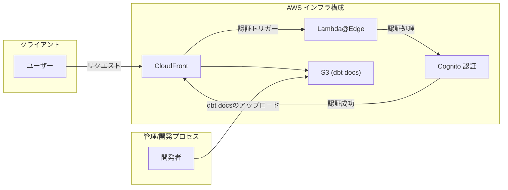

# dbt-site-cloudfront-cognito-sample


## 概要
- dbtプロジェクトのドキュメントを、Cognitoのログイン認証付きでAWS CloudFrontを利用してホスティングするサンプルです。
- プロジェクト内の TaskFile.yml には、ローカルでのドキュメント生成や、AWSリソースへの展開を行う各種タスクが定義されています。


## ディレクトリ構造
- `TaskFile.yml`: タスク定義ファイル。[task](https://taskfile.dev/)で実行可能なタスクが記述されています。
- `dbt-sample/`: dbtプロジェクトが格納されています。
  - `dbt_project`: dbtプロジェクトのルートディレクトリ。（VSCode等でdbt Power User等を利用する場合、ここをルートとして開いたほうがdbt内の開発は進めやすいです）
    - このサンプルではdatabricksを利用していますが、他のサービスを利用したい場合はdbtプロジェクト配下のみ変更すれば、インフラ側は変更は不要なはずです。
- `infrastructure/`: [AWS CDK](https://github.com/aws/aws-cdk)を用いたインフラ展開用のコードが含まれています。


## AWSインフラ構成




## 環境構築

### 準備
- [AWS CDK(TypeScript)のセットアップ](https://docs.aws.amazon.com/cdk/latest/guide/getting_started.html)
  - infrastructureディレクトリで `npm install` を実行すれば、AWS CDKのパッケージがインストールされるようになっています。
    - このディレクトリ下では `npx` を使って `cdk` コマンドを実行可能です。
  - デフォルトのリージョンは `ap-northeast-1` にしていますが、Cognitoの認証をCloudFrontのLambda@Edgeで行うため、 `cdk bootstrap` を `us-east-1` リージョンでも実行する必要があります。（Lambda@Edgeはus-east-1リージョンで管理する必要があるため）
  - 環境変数 `AWS_PROFILE` にAWS CLIで利用するプロファイル名を設定してください。
- [task](https://taskfile.dev/)を利用しているので、インストールが必要です。
- dbtプロジェクトについて
  - こちらのサンプルを動かす場合
    - dbtの環境を[uv](https://github.com/astral-sh/uv)で管理していますので、インストールが必要です。
    - データ基盤にdatabricksを利用しているので、[dbtからの接続セットアップ](https://docs.databricks.com/en/partners/prep/dbt.html)を行ってください。
  - 自前のdbtプロジェクトを利用する場合、こちらのサンプルを参考いただいたうえで、適宜修正して利用ください。


## 使用方法
1. 利用可能なタスク一覧を確認するには、以下のコマンドを実行します:
  ```sh
  task
  ```
2. dbtで生成したドキュメントをホストするAWSインフラを展開します:
  ```sh
  task deploy-all
  ```
3. CloudFrontでホストされるURLが表示されるので、コピーして環境変数 `CLOUDFRONT_URL` に設定します。
4. CloudFrontでホストされるURLをCognitoのリダイレクト先として許可するため、再度Cognitoのスタックをデプロイします。
  ```sh
  task deploy-cognito
  ```
5. dbtのドキュメントを生成し、ホストされるサイトに反映します:
  ```sh
  task update-dbt-docs
  ```
6. CloudFrontでホストされるURLにアクセスすると、Cognitoの認証画面が表示され、ログインすると、dbtのドキュメントが表示されます。
  - ログインユーザーはCognitoのAWSマネジメントコンソールから作成して利用してください。
